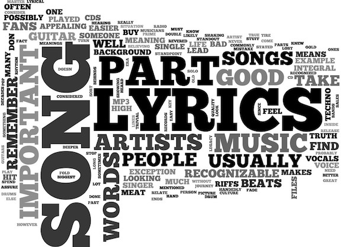

```{r setup, include=FALSE}
knitr::opts_chunk$set(echo = FALSE)
```

```{r warning=FALSE}
library(shiny)
library(ggplot2)
load('../../output/processed1_lyrics.RData')
```

##Sentiment Analysis of Lyrics



##Amount1
```{r}
dt.amount = data.frame(affin = tapply(dt_lyrics$affin.count, dt_lyrics$genre, mean),
bing = tapply(dt_lyrics$bing.count, dt_lyrics$genre, mean),
nrc = tapply(dt_lyrics$nrc.count, dt_lyrics$genre, mean))
dt.amount
```


##Amount2
```{r, echo = FALSE,warning=FALSE}
shinyAppDir("../shiny/shiny_amount",options=list(width="100%"))
```

##Frequency1
```{r}
dt.freq = data.frame(affin = tapply(dt_lyrics$affin.count/dt_lyrics$lyrics.length, dt_lyrics$genre, mean),
bing = tapply(dt_lyrics$bing.count/dt_lyrics$lyrics.length, dt_lyrics$genre, mean),
nrc = tapply(dt_lyrics$nrc.count/dt_lyrics$lyrics.length, dt_lyrics$genre, mean))
dt.freq
```

##Frequency2
```{r, echo = FALSE,warning=FALSE}
shinyAppDir("../shiny/shiny_frequency",options=list(width="100%"))
```

##Length1
```{r}
dt.length = data.frame(length = tapply(dt_lyrics$lyrics.length, dt_lyrics$genre, mean))
dt.length
```

##Length2
```{r, echo = FALSE,warning=FALSE}
shinyAppDir("../shiny/shiny_length",options=list(width="100%"))
```

##mean1
```{r}
dt.mean = data.frame(affin = tapply(dt_lyrics$affin.count*dt_lyrics$affin.mean, dt_lyrics$genre, sum)/tapply(dt_lyrics$affin.count, dt_lyrics$genre, sum),bing = tapply(dt_lyrics$bing.count*dt_lyrics$bing.mean, dt_lyrics$genre, sum)/tapply(dt_lyrics$bing.count, dt_lyrics$genre, sum))
dt.mean
```

##Mean2
```{r, echo = FALSE,warning=FALSE}
shinyAppDir("../shiny/shiny_mean",options=list(width="100%"))
```
